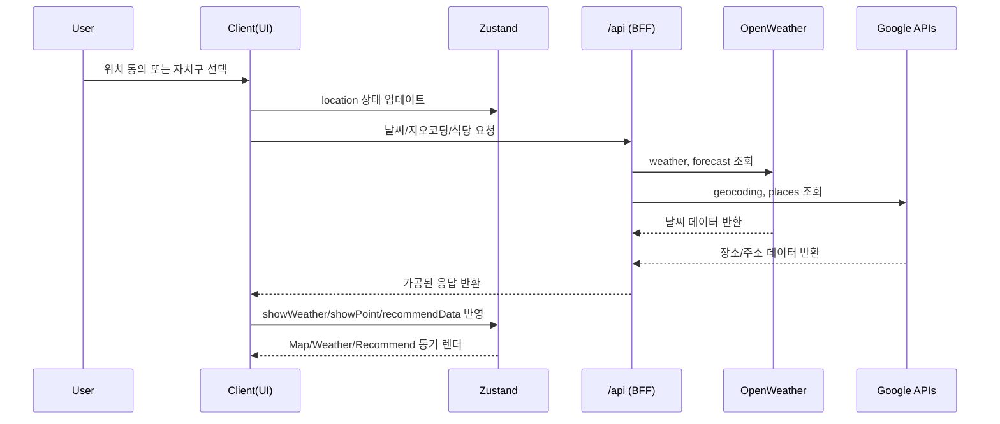

## 1) 프로젝트 소개 (Project Overview)


**서울 데이트 의사결정을 "날씨 × 위치 × 장소 데이터"로 압축한, 지도 중심 실시간 추천 플랫폼입니다.**

이 프로젝트는 단순 정보 나열이 아니라, 사용자의 **현재 위치/선택한 자치구**를 기준으로 날씨·데이트 스팟·맛집을 한 화면에서 연결해 **즉시 행동 가능한 선택지**를 제공하도록 설계했습니다.  
핵심은 "정보 조회"가 아니라 **결정 피로를 줄이는 UX 흐름**입니다.

- 위치 동의/거부 흐름과 서울 외 지역 예외 처리
- 구 단위 필터링 + 지도 마커 인터랙션(클러스터링 포함)
- 실시간/예보 날씨와 추천 장소·맛집의 결합
- 반응형 웹으로 데스크톱/태블릿/모바일 대응(디바이스별 지도 렌더 최적화) + 동일 서비스를 RN 네이티브 앱으로 확장

### 🧭 아키텍처 다이어그램

```mermaid
flowchart LR
  User[User]
  Browser[Browser / Client Components]
  NextApp[Next.js App Router]
  Route[/app/api/* Route Handlers]
  OpenWeather[OpenWeather API]
  GoogleMaps[Google Maps API]
  DataJSON[data/*.json]
  Zustand[Zustand Store]
  MapUI[Map UI]
  WeatherUI[Weather UI]
  RecommendUI[Recommend UI]

  User -->|위치 동의/구 선택| Browser
  Browser --> NextApp
  NextApp -->|BFF 호출| Route
  Route --> OpenWeather
  Route --> GoogleMaps
  NextApp --> DataJSON
  NextApp --> Zustand
  Zustand --> MapUI
  Zustand --> WeatherUI
  Zustand --> RecommendUI
```

### 🔄 데이터/상태 시퀀스



### 🔗 Links

- Live Demo: [https://date-eight-navy.vercel.app/](https://date-eight-navy.vercel.app/)
- Project Repository: [https://github.com/byeonsejun/date/tree/d0d4b60e4ecf717acd052406ba370e50874cf08c](https://github.com/byeonsejun/date/tree/d0d4b60e4ecf717acd052406ba370e50874cf08c)

### 권장 환경

- 브라우저: **Chrome** 권장 (Google Maps WebGL·지도 인터랙션 기준)
- 데스크톱: **1024px 이상**에서 3D(Vector) 지도 + 사용법 가이드 등 전체 기능 제공
- 모바일/태블릿: **반응형 레이아웃** 지원. WebGL 안정성을 위해 1024px 미만에서는 2D(Raster) 지도로 동작

### 🚀 Run Locally

패키지 매니저: `npm`  
권장 Node 버전: `.nvmrc` 기준 `20` (최소 `>=18.17`)

```bash
npm install
npm run dev
```

> 개발 서버는 Turbopack의 Route Handler 컴파일 이슈(`ComponentMod.handler is not a function`로 인한 `/api/*` 500)를 피하기 위해 `next dev --webpack`로 고정되어 있습니다.

#### Environment Variables

`.env.local`에 아래 키를 설정해야 합니다.

- `WEATHER_API_KEY` (서버 전용)
- `GOOGLE_MAPS_SERVER_KEY` (서버 전용)
- `NEXT_PUBLIC_GOOGLE_MAPS_API_KEY` (클라이언트 지도 SDK용)
- `NEXT_PUBLIC_GOOGLE_MAPS_ID`

#### Security

- `.env.local`은 **Git에 커밋하지 마세요.** (이미 `.gitignore`에 포함되어 있어야 합니다.)
- API 키·`mapId` 값은 **공개 저장소·스크린샷·이슈 본문**에 노출하지 마세요.
- 서버 전용 키(`WEATHER_API_KEY`, `GOOGLE_MAPS_SERVER_KEY`)는 **도메인/IP 제한**을 적용하고, 클라이언트 키는 **HTTP referrer 제한**을 반드시 설정하세요.

### 📸 스크린샷 가이드

데스크톱 메인/지역변경/추천식당 동작과 모바일·태블릿 뷰포트 캡처를 README에 표시합니다.

```text
docs/images/
├─ 01-hero.png
├─ 02-location-change.mp4      # 지역 변경 동작
├─ 05-restaurants-panel.mp4    # 추천 식당 UI (펼침/리스트)
├─ 06-restaurants.mp4          # 추천 식당 · 맛집 연동
├─ mobile-iphone12-home.png    # iPhone 12 (390×844)
└─ mobile-ipadmini-home.png    # iPad mini (768×1024)
```


[지역 변경 동작 영상 (mp4)](docs/images/02-location-change.mp4)

[추천 식당 펼침 (캡처 1, mp4)](docs/images/05-restaurants-panel.mp4)

[추천 식당 · 맛집 연동 (캡처 2, mp4)](docs/images/06-restaurants.mp4)

모바일/태블릿 뷰포트 캡처:

- iPhone 12 (Home): [mobile-iphone12-home.png](docs/images/mobile-iphone12-home.png)
- iPad mini (Home): [mobile-ipadmini-home.png](docs/images/mobile-ipadmini-home.png)

---

## 2) 기술 스택 및 도입 배경 (Tech Stack & Why)

- **Next.js 16 (App Router)**  
  서버 컴포넌트와 클라이언트 컴포넌트를 분리해, 데이터 로딩(Header/정적 데이터)과 인터랙션(Map/Weather)을 책임 분리하기 위해 도입.
- **Route Handlers (`/app/api/*`)**  
  외부 API 키 노출 및 CORS 이슈를 줄이기 위해 BFF 형태의 서버 프록시 계층을 구성.
- **Zustand**  
  지도/마커/위치/추천 데이터처럼 전역에서 얕고 빠르게 공유해야 하는 상태를 보일러플레이트 최소화로 관리하기 위해 선택.
- **SWR**  
  클라이언트 fetch 정책을 중앙에서 통제하고, 재검증 전략을 단순화해 예측 가능한 데이터 패칭 경험을 확보.
- **Google Maps JS API (WebGL Vector + mapId)**  
  데스크톱에서는 3D/틸트/밀도 높은 인터랙션으로 몰입형 탐색을, 모바일/태블릿(1024px 미만)에서는 WebGL 실패(Vector→Raster fallback)를 막기 위해 2D 지도로 분기.
- **OpenWeather API**  
  추천 경험에 시간성(현재/예보)을 결합해 "오늘 갈 만한 장소"라는 맥락 기반 추천을 강화.
- **Tailwind CSS**  
  빠른 UI 실험과 컴포넌트 단위 스타일 캡슐화, 그리고 반응형 레이아웃(모바일 스크롤/푸터 래핑 등)을 위해 유틸리티 퍼스트 방식 채택.
- **TypeScript + zod**  
  외부 API(OpenWeather/Google Places/Geocode) 응답을 타입과 런타임 스키마로 함께 검증해 안정성을 강화.
- **Vitest + Testing Library**  
  유틸/스토어/훅 단위 테스트로 회귀를 방지하고, Husky + lint-staged로 커밋 전 품질 게이트를 적용.

---

## 3) 아키텍처 및 폴더 구조 (Architecture)

### 폴더 구조 (요약)

```text
portfolio-next/
├─ data/                      # 공원/문화공간/두드림길/차트 원천 데이터(JSON)
├─ src/
│  ├─ app/
│  │  ├─ api/                 # weather/location/restaurants route handlers (.ts)
│  │  ├─ statistics/          # 통계 라우트(현재 홈으로 redirect)
│  │  ├─ layout.tsx
│  │  └─ page.tsx
│  ├─ components/             # UI/지도/날씨/추천 컴포넌트 (.tsx)
│  │  └─ ui/                  # 차트, 모달, 공통 UI
│  ├─ context/                # SWRConfig
│  ├─ hooks/                  # useWeather
│  ├─ service/                # 외부/로컬 데이터 접근 로직 (.ts)
│  ├─ stores/                 # Zustand 전역 상태(도메인 슬라이스)
│  ├─ types/                  # 외부 API 타입 정의
│  ├─ utils/                  # 공통 유틸
│  └─ proxy.js                # /api CORS 정책
└─ public/
```

### 설계 포인트

- **UI vs 비즈니스 로직 분리**  
  `components`는 표현/인터랙션에 집중, `hooks/useWeather`와 `service/*`가 데이터 가공/흐름 제어를 담당.
- **BFF 패턴으로 외부 API 추상화**  
  클라이언트는 `/api/*`만 호출하고, 외부 API 세부사항/키/응답 가공은 서버 라우트에서 처리.
- **상태 단일화**  
  `LocationStore`에서 위치, 마커, 날씨, 추천 데이터까지 연결해 지도 중심 UX의 상태 일관성을 유지.
- **정적 데이터 로딩 최적화**  
  `park/culturalSpace/dodreamgil` 원천 JSON 총량이 약 **4MB** 수준이라, `getAllLocationInfo`에 모듈 메모이제이션을 적용해 서버 인스턴스 내 중복 파일 I/O/파싱 비용을 줄임.

### 데이터 흐름 (핵심)

`사용자 입력(위치/구 선택)`  
→ `Zustand 상태 변경`  
→ `hook/service에서 API 호출`  
→ `showWeather/showPoint/recommendData 업데이트`  
→ `지도/사이드패널 동기 렌더`

---

## 4) 🔥 핵심 트러블슈팅 및 기술적 고민 (Troubleshooting)

### 4-1) 지도 초기 렌더 시 회색 화면 + 구 변경 후에만 표시되는 문제

**Situation**  
초기 렌더에서 Google Map이 회색으로 남고, 구를 변경해야만 지도가 정상 표시되는 현상 발생.

**Cause**  
초기 로딩 시점에는 `allDistrictInfo`가 아직 비어 있고, 지도 중심 적용 effect가 필요한 시점에 재실행되지 않아 `panTo`가 누락됨.

**Solution/Action**

- `onLoad`에서 초기 중심 적용을 즉시 실행
- `allDistrictInfo`를 의존성에 포함해 데이터 로드 후 재적용 보장
- 기본 center fallback으로 초기 공백 상태 방지

```jsx
onLoad={(map) => {
  mapRef.current = map;
  syncTiltByZoom();
  handleCenterPosition(location);
}}
```

### 4-2) 지도 이동 중 이전 위치로 튀는(되돌아가는) 카메라 점프

**Situation**  
드래그/마커 hover·click 시 지도 중심이 과거 위치로 되돌아가는 현상이 간헐적으로 발생.

**Cause**  
`GoogleMap`에 `center`를 지속 주입하는 controlled 패턴과 내부 `panTo`가 충돌하여, 리렌더 때마다 중심이 재강제됨.

**Solution/Action**

- `center` 대신 `defaultCenter`로 초기값만 주입
- 이후 카메라 이동은 `panTo`로만 제어하는 단일 경로로 통합

```jsx
const initialCenterRef = useRef(getCenterPosition() ?? DEFAULT_CENTER);
<GoogleMap defaultCenter={initialCenterRef.current} ... />
```

### 4-3) WebGL `CONTEXT_LOST`/`INVALID_OPERATION` 및 심한 프레임 드랍

**Situation**  
3D 지도(WebGL)에서 이동/확대 반복 시 `CONTEXT_LOST_WEBGL`과 버퍼 관련 에러가 발생, 체감 랙이 급증.

**Cause**  
고정 3D 틸트 + 잦은 줌 이벤트 + 다량 마커 렌더가 겹치며 GPU 부하가 임계치를 넘음.

**Solution/Action**

- 줌 레벨 기반으로 3D 활성화 구간을 제한
- 동일 값 상태 업데이트를 차단해 리렌더 빈도 감소
- 지도 옵션 객체를 안정적으로 유지해 재초기화 리스크 축소
- 밀집 구간 마커는 클러스터링으로 묶어 렌더링 부담 완화

```jsx
const nextTilt = currentZoom >= 16 ? 45 : 0;
if (map.getTilt() !== nextTilt) map.setTilt(nextTilt);
setMapTilt((prev) => (prev === nextTilt ? prev : nextTilt));
```

### 4-4) 모바일/태블릿에서 "Vector Map 로드 실패 → Raster fallback" 콘솔 에러

**Situation**  
모바일·태블릿에서 진입 시 `Attempted to load a Vector Map, but failed. Falling back to Raster` 경고가 콘솔에 지속 노출.

**Cause**  
저사양/모바일 GPU 환경에서 `mapId` 기반 Vector(3D) 지도 초기화가 실패하는데, 데스크톱과 동일한 옵션을 그대로 주입하고 있었음.

**Solution/Action**

- 뷰포트 폭(`< 1024px`)으로 `isDesktop`을 판별해 모바일/태블릿에서는 `mapId`를 `undefined`, `tilt`를 `0`으로 강제
- 의미 없는 지도 사용법 가이드(`TextInfoModal`, Shift 드래그 안내)는 데스크톱에서만 렌더

```jsx
const mapOptions = useMemo(
  () => ({ ...mapOptionsBase, mapId: isDesktop ? process.env.NEXT_PUBLIC_GOOGLE_MAPS_ID : undefined }),
  [isDesktop],
);
```

### 4-5) `/api/weather` 500 + 클라이언트 `Unexpected token '<'`

**Situation**  
날씨 호출이 간헐적으로 500을 반환하고, 클라이언트에서 `Unexpected token '<'`(HTML 응답 파싱)으로 크래시.

**Cause**  
Turbopack 개발 서버의 Route Handler 컴파일 이슈(`ComponentMod.handler is not a function`)로 `/api/*`가 JSON 대신 HTML 에러 페이지를 반환. 클라이언트는 이를 무조건 `res.json()`으로 파싱.

**Solution/Action**

- `dev` 스크립트를 `next dev --webpack`로 고정해 컴파일 이슈 회피
- `fetchJsonOrThrow`로 `res.ok`/`content-type`을 검증해 비-JSON 응답을 안전하게 에러로 변환
- `useWeather`의 호출부를 `try/catch/finally`로 감싸 로딩 상태 누수 방지

### 4-6) 통계 차트 "Maximum update depth exceeded" 무한 렌더 루프

**Situation**  
통계 화면 진입 시 `BarChart`에서 setState 무한 루프가 발생해 페이지가 멈춤.

**Cause**  
파생 데이터가 매 렌더마다 새 참조로 생성되어 `useEffect` 의존성이 항상 바뀌고, 그 안에서 다시 setState가 호출됨.

**Solution/Action**

- 파생 데이터(`filteredData`, `baseGenderData`)를 `useMemo`로 안정화
- `setGenderData`는 안정화된 값이 실제로 바뀔 때만 호출하도록 조건화

> 통계 페이지 자체는 데모성 데이터(허위정보 소지)라 판단해 라우트를 홈으로 `redirect` 처리했고, 위 수정은 차트 컴포넌트 회귀 방지를 위해 유지합니다.

### 4-7) 모바일 반응형 레이아웃(스크롤/메뉴/푸터)

**Situation**  
모바일에서 세로 스크롤이 막히고, 네비 메뉴가 화면 밖으로 튀어나오며, 370px 미만에서 푸터 문구가 깨짐.

**Cause**  
루트 레이아웃의 `h-full` + `overflow-hidden` 고정, 데스크톱 전용 메뉴 구조, 줄바꿈 미고려 푸터 마크업.

**Solution/Action**

- `body`를 `min-h-screen`, `main`을 `overflow-visible lg:overflow-hidden`으로 변경해 모바일 스크롤 복구
- 사용하지 않는 모바일 메뉴 UI 제거(`NavComponent`는 위치 초기화 로직만 유지)
- 푸터는 `max-[370px]`에서 2줄로 래핑되도록 처리

### 4-8) 접근성(키보드 내비게이션 / 스크린리더 / 모달 포커스)

**Situation**  
탭형 UI와 모달이 `<li onClick>`·장식성 마크업 위주로 구성되어, 키보드만 사용하는 사용자나 스크린리더 사용자가 날씨 기간 전환·추천 토글·지도 타입 필터·위치 동의 모달에 접근하기 어려웠음.

**Cause**  
인터랙션 요소가 시맨틱 버튼이 아니라 클릭 핸들러만 달린 비포커서블 요소였고, 탭 UI에 역할/선택 상태 정보가 없었으며, 모달은 열린 뒤에도 포커스가 배경에 머물러 있었음.

**Solution/Action**

- 탭형 UI(날씨 기간 / 추천·인기 / 지도 타입)를 실제 `<button>`으로 교체하고 `role="tablist"`·`role="tab"`·`role="presentation"`과 `aria-selected`, `aria-controls`/`aria-labelledby`를 부여해 `Tab`/`Enter` 키보드 동작과 상태 노출을 확보 (`Weather.tsx`, `RecommendPlace.tsx`, `SelectShowMapType.tsx`)
- 위치 동의 모달에 `focus-trap-react`로 포커스 트랩을 적용하고 `role="dialog"`·`aria-modal="true"`·`aria-label`을 부여 (`LocationConsentModal.tsx`)
- 이미지 `alt`를 의미 기반으로 정리: 추천/식당/지도 대표 이미지는 `"{name} 대표 이미지"`, 날씨 아이콘은 날씨 설명 텍스트, 순수 장식 이미지는 `alt=""` + `aria-hidden="true"`
- 측정 결과: Lighthouse Accessibility **96** (아래 측정 지표 섹션 참고)

> 마커 이동 버튼 등 지도 인터랙션 요소에는 `aria-label`(예: `"{title} 위치로 지도 이동"`)을 부여. 추가 스크린리더 시나리오 검증은 [TODO].

---

## 5) 📊 측정 지표 (Measured Metrics)

측정 일시: **2026-06-01**  
측정 기준: Lighthouse CLI (`https://date-eight-navy.vercel.app/`)

- Home (`/`)
  - Lighthouse: Performance **29** / Accessibility **96** / Best Practices **96** / SEO **100**
  - Core Web Vitals: FCP **4.9s**, LCP **6.6s**, TBT **3950ms**, CLS **0**
- Bundle 분석
  - `@next/bundle-analyzer` 도입, `npm run analyze`로 리포트 생성
  - 리포트 경로: `.next/analyze/client.html`, `.next/analyze/nodejs.html`, `.next/analyze/edge.html`
  - 현재 빌드 기준 First Load JS: Home **103kB**
- 식당 추천 API payload 비교 (`/api/restaurants`, 중구 좌표 기준 5건)
  - 현재(URL 반환): **9,935 bytes**
  - 기존(base64 내장 가정 시뮬레이션): **314,546 bytes**
  - 응답 크기 절감: **304,611 bytes (96.84%)**
- 지도 인터랙션 평균 FPS (Chrome DevTools Performance Trace, 2026-06-11)
  - 시나리오: `종로구` + `전체` 마커 (데이터 기준 **259개**)
  - 측정 방식: 확대/축소 + 드래그 반복 8회 구간 Trace에서 `DrawFrame` 이벤트 기반 계산
  - 결과: **26.72 FPS** (`eventCount: 250`, `duration: 9.35s`)

> Long task / context loss rate 자동 계측은 후속 계획으로 유지하고 있습니다.

---

## ADR Index

- [ADR 0001: Why Zustand Over Redux](docs/adr/0001-why-zustand-over-redux.md)
- [ADR 0002: Why App Router Over Pages Router](docs/adr/0002-why-app-router-over-pages.md)
- [ADR 0003: BFF Pattern for API Keys](docs/adr/0003-bff-pattern-for-api-keys.md)
- [ADR 0004: Why Marker Clustering Was Added Later](docs/adr/0004-why-no-clustering-initially-then-added.md)

---

## 6) 향후 계획 (Next Steps)

- 현재 지도/날씨/추천 흐름을 기준으로, 성능 계측(long task, context loss rate) 자동화
- `/api` 계층 고도화(응답 캐싱, 장애 fallback, rate limit 대응)로 운영 안정성 강화
- 상태 구조를 도메인 기준으로 재정렬해 테스트 가능한 단위(Selector/Action) 확장

---

## 7) 🧩 크로스 플랫폼 확장 (Cross-Platform)

이 레포는 **반응형 웹(Next.js)** 구현체이며, 동일 서비스를 **React Native 네이티브 앱으로 별도 레포에서 재구현**했습니다. 두 구현체는 코드를 공유하지 않습니다 — 웹은 JavaScript, RN은 **Expo(SDK 54) + expo-router + TypeScript + FSD(Feature-Sliced Design)** 스택이라 소스 공유가 불가능하며, RN은 웹의 도메인 로직·데이터·상태 설계를 **참조해 처음부터 새로 작성**했습니다.

핵심은 "코드를 재사용"한 것이 아니라, **도메인 로직·API 계약·상태 모델을 UI에서 분리해 설계해둔 덕분에 코드를 공유하지 않고도 같은 설계를 RN으로 옮기는 비용이 낮았다**는 점입니다.

- **상태** — 웹의 단일 `LocationStore`를 RN에서는 FSD 원칙에 따라 entity별 Zustand 스토어(location / weather / map / restaurant 등)로 분해.
- **데이터** — 서울 자치구 정적 데이터·차트 데이터(`chartData.json` 등)는 웹 자산을 옮겨와 RN 타입으로 재가공.
- **API** — RN은 기본적으로 외부 API(OpenWeather / Google)를 직접 호출하며, 환경변수(`EXPO_PUBLIC_API_BASE_URL`) 설정 시 웹 `/api/*` 프록시 경유(폴백)를 선택적으로 지원.

### 링크 / 배포

- 📱 React Native 앱 저장소: [github.com/byeonsejun/date-rn](https://github.com/byeonsejun/date-rn)
- 📦 APK 다운로드: [v1.0.0 APK](https://github.com/byeonsejun/date-rn/releases/download/v1.0.0/application-ee38c224-aa77-4725-8989-20ec94b234b7.apk)

> **설치 안내**: APK는 **Android 전용**이며, 스토어 미출시 상태라 설치 시 기기에서 **"알 수 없는 출처(출처를 알 수 없는 앱) 설치 허용"** 을 켜야 합니다. (iOS는 사이드로딩 제약으로 APK 설치 불가)

> **상태**: EAS Build(`preview` = APK) 기반 **내부 테스트 단계**입니다. 핵심 기능(지도·위치 동의·날씨·추천·맛집·통계)은 웹과 대응되며, 웹 플랫폼용 지도 화면 등 일부를 보강 중입니다. 스토어 출시는 진행하지 않았습니다.
