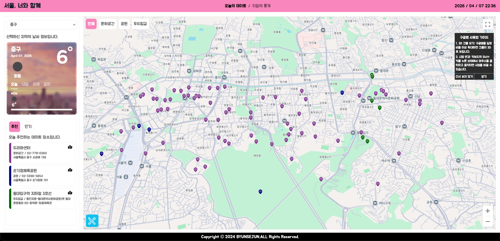
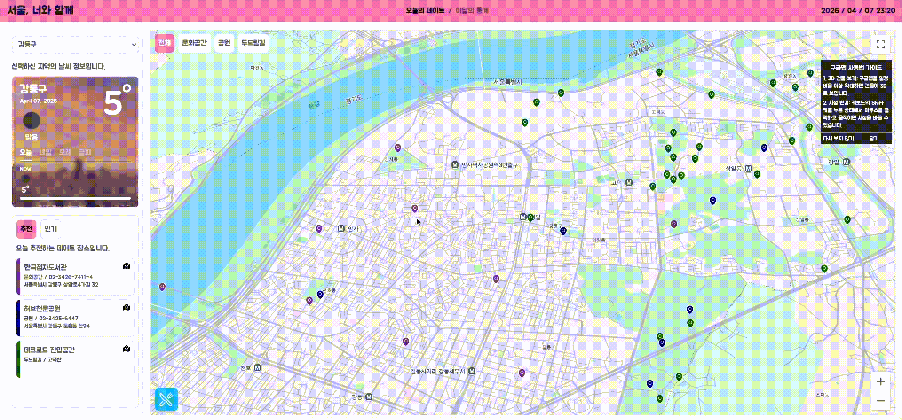
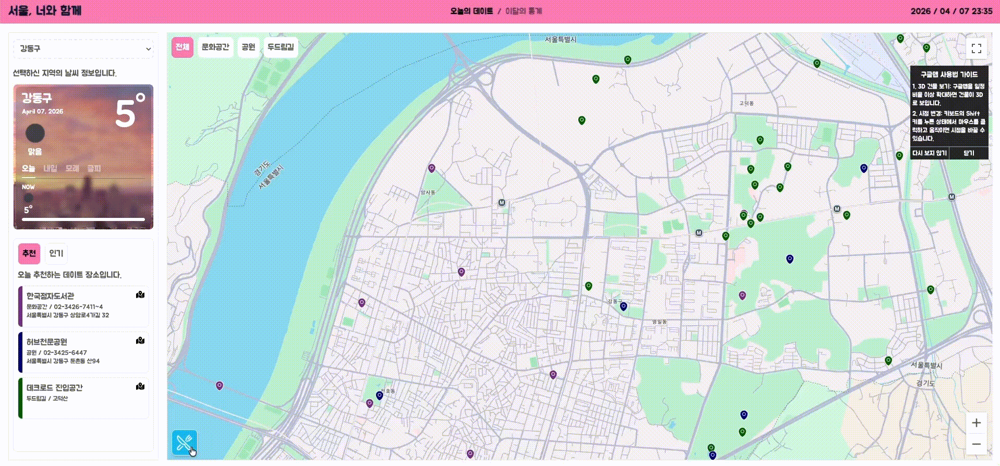
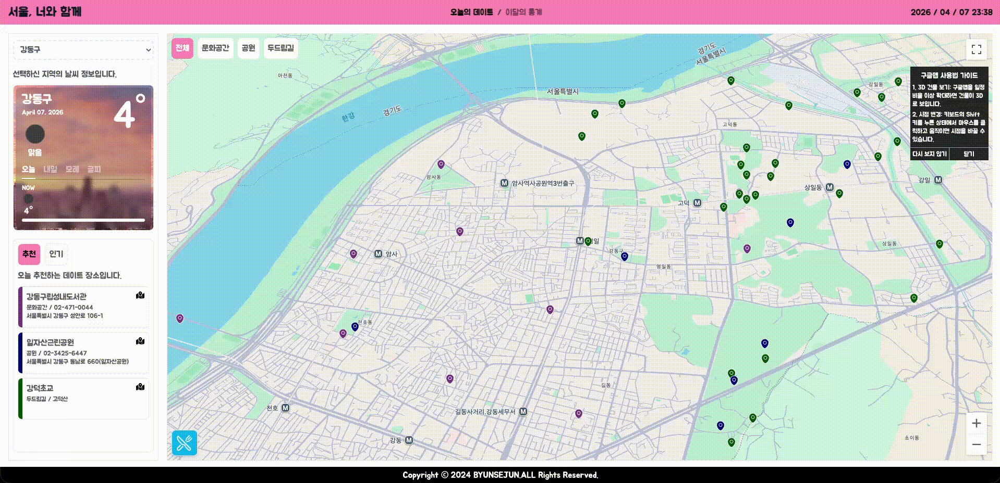

## 1) 프로젝트 소개 (Project Overview)

**서울 데이트 의사결정을 "날씨 × 위치 × 장소 데이터"로 압축한, 지도 중심 실시간 추천 플랫폼입니다.**

이 프로젝트는 단순 정보 나열이 아니라, 사용자의 **현재 위치/선택한 자치구**를 기준으로 날씨·데이트 스팟·맛집을 한 화면에서 연결해 **즉시 행동 가능한 선택지**를 제공하도록 설계했습니다.  
핵심은 "정보 조회"가 아니라 **결정 피로를 줄이는 UX 흐름**입니다.

- 위치 동의/거부 흐름과 서울 외 지역 예외 처리
- 구 단위 필터링 + 지도 마커 인터랙션
- 실시간/예보 날씨와 추천 장소의 결합
- 통계 페이지에서 지역/성별/연령 기반 시각화 제공

### 🔗 Links

- Live Demo: [https://date-eight-navy.vercel.app/](https://date-eight-navy.vercel.app/)
- Project Repository: [https://github.com/byeonsejun/date/tree/d0d4b60e4ecf717acd052406ba370e50874cf08c](https://github.com/byeonsejun/date/tree/d0d4b60e4ecf717acd052406ba370e50874cf08c)

### 권장 환경

- 브라우저: **Chrome** 권장 (Google Maps WebGL·지도 인터랙션 기준)
- 해상도: 최소 **1280px** 너비 이상 (`body` 최소 너비와 동일)

### 🚀 Run Locally

```bash
npm install
npm run dev
```

#### Environment Variables

`.env.local`에 아래 키를 설정해야 합니다.

- `NEXT_PUBLIC_WEATHER_API_KEY`
- `NEXT_PUBLIC_GOOGLE_MAPS_API_KEY`
- `NEXT_PUBLIC_GOOGLE_MAPS_ID`

#### Security

- `.env.local`은 **Git에 커밋하지 마세요.** (이미 `.gitignore`에 포함되어 있어야 합니다.)
- API 키·`mapId` 값은 **공개 저장소·스크린샷·이슈 본문**에 노출하지 마세요.

### 📸 스크린샷 가이드

현재 반영된 캡처(메인/지역변경/추천식당×2/통계) 기준으로 README에 바로 표시됩니다.

```text
docs/images/
├─ 01-hero.png
├─ 02-location-change.gif
├─ 05-restaurants-panel.gif   # 추천 식당 UI (펼침/리스트 등 1차 캡처)
├─ 06-restaurants.gif          # 추천 식당 관련 2차 캡처(동작·각도 다름)
└─ 07-statistics-page.gif
```



[](docs/images/02-location-change.gif)

[](docs/images/05-restaurants-panel.gif)

[](docs/images/06-restaurants.gif)

[](docs/images/07-statistics-page.gif)

---

## 2) 기술 스택 및 도입 배경 (Tech Stack & Why)

- **Next.js 13 (App Router)**  
  서버 컴포넌트와 클라이언트 컴포넌트를 분리해, 데이터 로딩(Header/통계 데이터)과 인터랙션(Map/Weather)을 책임 분리하기 위해 도입.
- **Route Handlers (`/app/api/*`)**  
  외부 API 키 노출 및 CORS 이슈를 줄이기 위해 BFF 형태의 서버 프록시 계층을 구성.
- **Zustand**  
  지도/마커/위치/추천 데이터처럼 전역에서 얕고 빠르게 공유해야 하는 상태를 보일러플레이트 최소화로 관리하기 위해 선택.
- **SWR**  
  클라이언트 fetch 정책을 중앙에서 통제하고, 재검증 전략을 단순화해 예측 가능한 데이터 패칭 경험을 확보.
- **Google Maps JS API (WebGL Vector + mapId)**  
  단순 지도 임베드가 아니라 3D/틸트/밀도 높은 인터랙션을 지원해 몰입형 탐색 경험을 만들기 위해 사용.
- **OpenWeather API**  
  추천 경험에 시간성(현재/예보)을 결합해 "오늘 갈 만한 장소"라는 맥락 기반 추천을 강화.
- **Tailwind CSS**  
  빠른 UI 실험과 컴포넌트 단위 스타일 캡슐화를 위해 유틸리티 퍼스트 방식 채택.
- **Chart.js (`react-chartjs-2`)**  
  통계 페이지에서 다차원 비교(레이더/바) 시각화를 빠르게 구현하기 위한 실전 선택.

---

## 3) 아키텍처 및 폴더 구조 (Architecture)

### 폴더 구조 (요약)

```text
portfolio-next/
├─ data/                      # 공원/문화공간/두드림길/차트 원천 데이터(JSON)
├─ src/
│  ├─ app/
│  │  ├─ api/                 # weather/location/restaurants route handlers
│  │  ├─ statistics/          # 통계 페이지
│  │  ├─ layout.jsx
│  │  └─ page.jsx
│  ├─ components/             # UI/지도/날씨/추천 컴포넌트
│  │  └─ ui/                  # 차트, 모달, 공통 UI
│  ├─ context/                # SWRConfig
│  ├─ hooks/                  # useWeather, useWebSocket
│  ├─ service/                # 외부/로컬 데이터 접근 로직
│  ├─ stores/                 # Zustand 전역 상태
│  └─ middleware.js           # /api CORS 정책
└─ public/
```

### 설계 포인트

- **UI vs 비즈니스 로직 분리**  
  `components`는 표현/인터랙션에 집중, `hooks/useWeather`와 `service/*`가 데이터 가공/흐름 제어를 담당.
- **BFF 패턴으로 외부 API 추상화**  
  클라이언트는 `/api/*`만 호출하고, 외부 API 세부사항/키/응답 가공은 서버 라우트에서 처리.
- **상태 단일화**  
  `LocationStore`에서 위치, 마커, 날씨, 추천 데이터까지 연결해 지도 중심 UX의 상태 일관성을 유지.

### 데이터 흐름 (핵심)

`사용자 입력(위치/구 선택)`  
→ `Zustand 상태 변경`  
→ `hook/service에서 API 호출`  
→ `showWeather/showPoint/recommendData 업데이트`  
→ `지도/사이드패널 동기 렌더`

---

## 4) 🔥 핵심 트러블슈팅 및 기술적 고민 (Troubleshooting)

### 4-1) 지도 초기 렌더 시 회색 화면 + 구 변경 후에만 표시되는 문제

**Situation**  
초기 렌더에서 Google Map이 회색으로 남고, 구를 변경해야만 지도가 정상 표시되는 현상 발생.

**Cause**  
초기 로딩 시점에는 `allDistrictInfo`가 아직 비어 있고, 지도 중심 적용 effect가 필요한 시점에 재실행되지 않아 `panTo`가 누락됨.

**Solution/Action**

- `onLoad`에서 초기 중심 적용을 즉시 실행
- `allDistrictInfo`를 의존성에 포함해 데이터 로드 후 재적용 보장
- 기본 center fallback으로 초기 공백 상태 방지

```jsx
onLoad={(map) => {
  mapRef.current = map;
  syncTiltByZoom();
  handleCenterPosition(location);
}}
```

### 4-2) 지도 이동 중 이전 위치로 튀는(되돌아가는) 카메라 점프

**Situation**  
드래그/마커 hover·click 시 지도 중심이 과거 위치로 되돌아가는 현상이 간헐적으로 발생.

**Cause**  
`GoogleMap`에 `center`를 지속 주입하는 controlled 패턴과 내부 `panTo`가 충돌하여, 리렌더 때마다 중심이 재강제됨.

**Solution/Action**

- `center` 대신 `defaultCenter`로 초기값만 주입
- 이후 카메라 이동은 `panTo`로만 제어하는 단일 경로로 통합

```jsx
const initialCenterRef = useRef(getCenterPosition() ?? DEFAULT_CENTER);
<GoogleMap defaultCenter={initialCenterRef.current} ... />
```

### 4-3) WebGL `CONTEXT_LOST`/`INVALID_OPERATION` 및 심한 프레임 드랍

**Situation**  
3D 지도(WebGL)에서 이동/확대 반복 시 `CONTEXT_LOST_WEBGL`과 버퍼 관련 에러가 발생, 체감 랙이 급증.

**Cause**  
고정 3D 틸트 + 잦은 줌 이벤트 + 다량 마커 렌더가 겹치며 GPU 부하가 임계치를 넘음.

**Solution/Action**

- 줌 레벨 기반으로 3D 활성화 구간을 제한
- 동일 값 상태 업데이트를 차단해 리렌더 빈도 감소
- 지도 옵션 객체를 안정적으로 유지해 재초기화 리스크 축소

```jsx
const nextTilt = currentZoom >= 16 ? 45 : 0;
if (map.getTilt() !== nextTilt) map.setTilt(nextTilt);
setMapTilt((prev) => (prev === nextTilt ? prev : nextTilt));
```

---

## 5) 향후 계획 (Next Steps)

- 현재 지도/날씨/추천 흐름을 기준으로, **마커 클러스터링** 및 성능 계측(FPS, long task, context loss rate) 자동화
- `/api` 계층 고도화(응답 캐싱, 장애 fallback, rate limit 대응)로 운영 안정성 강화
- 상태 구조를 도메인 기준으로 재정렬해 테스트 가능한 단위(Selector/Action) 확장
- 접근성 개선(키보드 내비게이션, ARIA, 모달 포커스 트랩) 및 모바일 제스처 UX 정교화

**현재 이 웹 프로젝트의 비즈니스 로직과 아키텍처를 바탕으로, 크로스 플랫폼 지원을 위해 React Native(Expo) + FSD(Feature-Sliced Design) 아키텍처 기반의 모바일 앱으로 마이그레이션을 진행 중입니다.**
